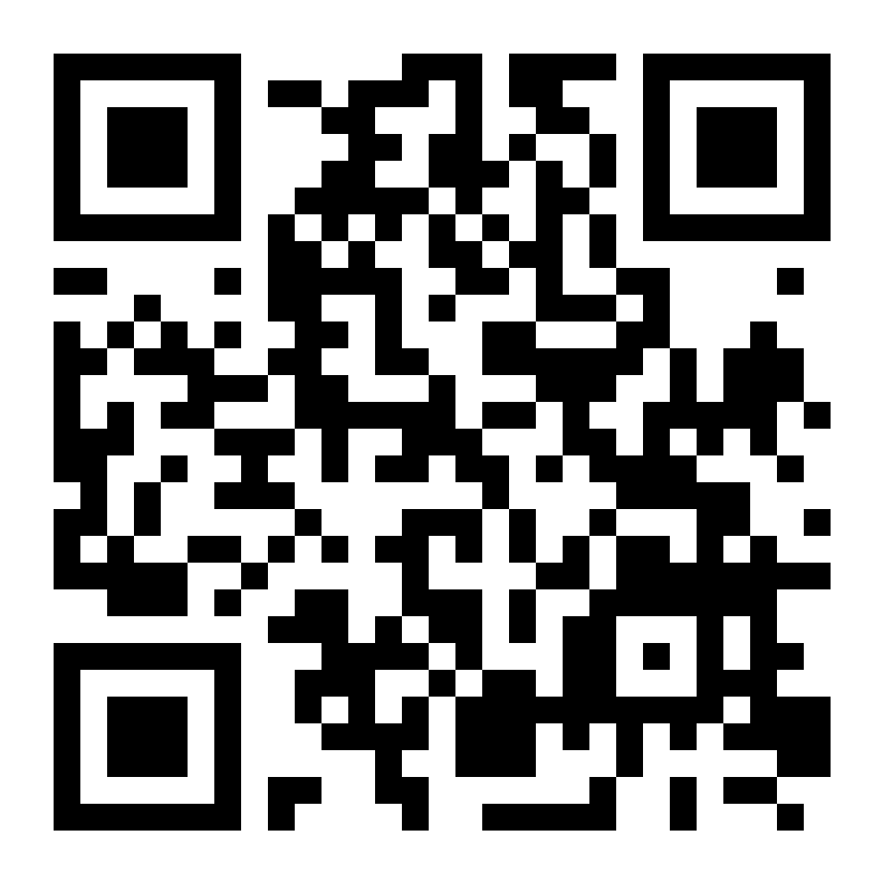

# Collaborative Workshop on Social Contact Patterns in South Korea: Research Findings, Applications, and Future Directions

#### 코로나19를 비롯한 감염병 대유행은 공중 보건을 넘어 우리 사회 전반에 심각한 영향을 미쳤습니다. 이러한 위기 속에서 접촉패턴 연구의 중요성이 그 어느 때보다 부각되고 있습니다.
#### 본 워크숍에서는 국내 감염병 연구자 및 보건의료 관계자들이 모여 호흡기 감염병 전파가능 밀접접촉 조사 결과와 그 활용 사례를 공유하고, 접촉패턴 연구의 의의, 효과적인 활용 방안 및 향후 개선 방향에 대해 함께 논의하는 소중한 시간을 가질 예정입니다.
#### 감염병 대응의 미래를 함께 그려나갈 이번 워크숍에 여러분의 귀중한 경험과 통찰력을 나눠주시기 바랍니다. 여러분의 참여가 우리 사회의 감염병 대응 역량을 한 단계 높이는 밑거름이 될 것입니다.

- 일시 : 2025년 5월 19일 (월)
- 장소 : 코트야드 서울 남대문
- 주관 : 국가수리과학연구소 감염병연구팀
- 문의 : [epirt@nims.re.kr](https://mail.nims.re.kr:8443/mail/#compose?to=epirt%40nims.re.kr)
- 사전등록: https://forms.gle/QKDNXFR1Kqm75KDj9

**오시는 길**

주소: 서울 중구 남대문로 9 코트야드 메리어트 서울 남대문 호텔

https://maps.app.goo.gl/tYSJC9TU52sLk7rZ6
